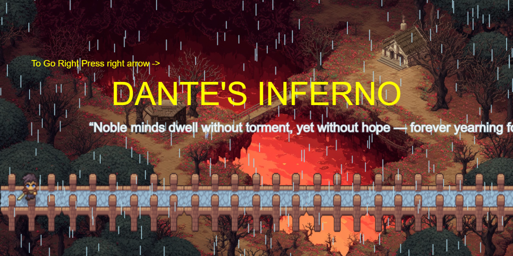
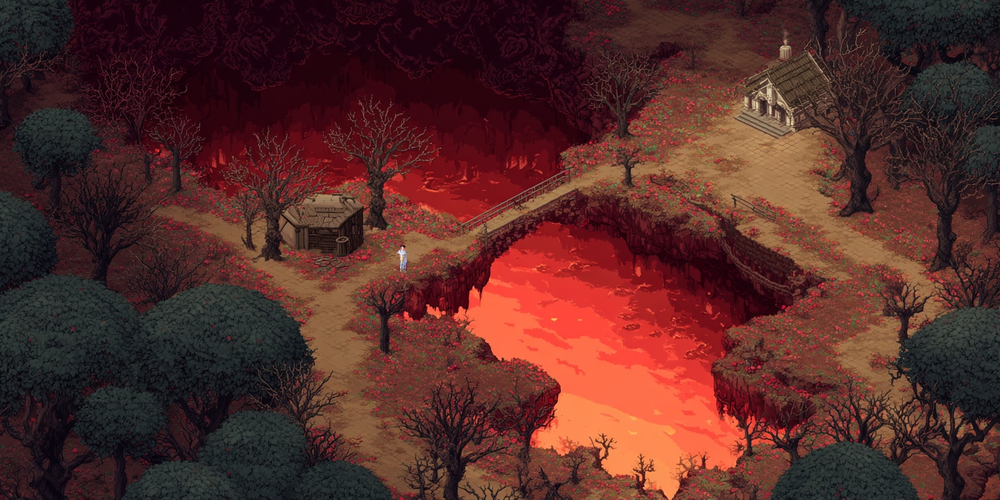
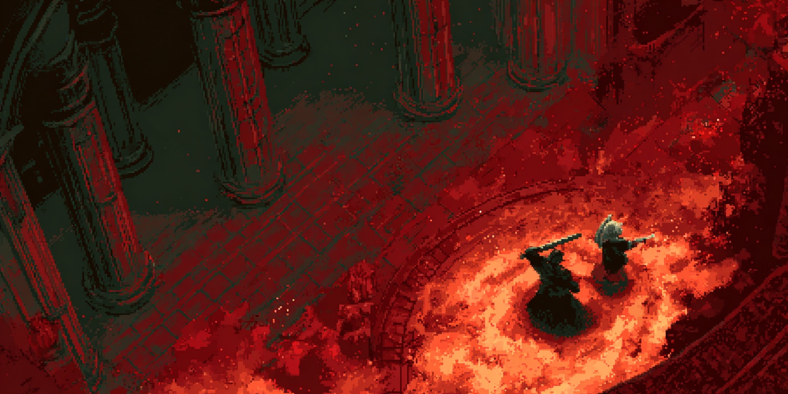
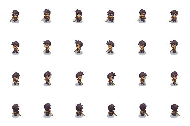
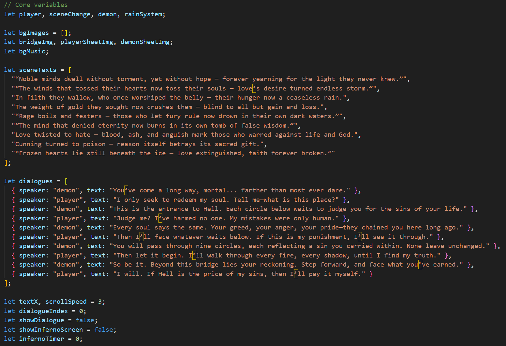
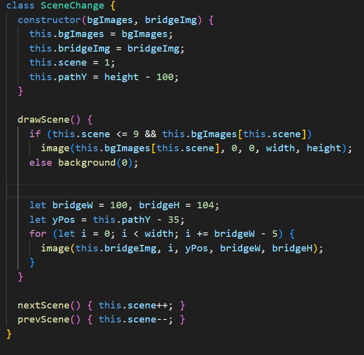

# DANTE'S INFERNO

## Why I Chose This Topic
I chose Dante’s Inferno because it talks about human mistakes, guilt, and the search for redemption. It has deep emotions and strong visuals that can be turned into interesting game scenes. I wanted to show a journey of discovery and the artists intent on the layers of hell. In this each background shows a part of the hell portrayed by dante. This experience is a mix of AI, coding, storytelling and visual design.

## Visual Design
All the backgrounds were made using Midjourney, an AI image generator. A lot of thought was gone for creating the visual background as each layer show a part of hell and the user must visually know what each image represent. My goal was to make players feel each level rather than simply move through it. Each background image covers the full screen, creating a feeling of continuity as the character travels from one level to another. For the player and the demon, I used sprite sheets downloaded from free sprite sources. The player sprite shows a swordsman walking, with left and right directions. The demon sprite was chosen for its idle animation, where it stands still but moves slightly giving it a sense of life even without speech. I adjusted their sizes, positions, and facing direction in code to fit naturally with the backgrounds. The player’s movement is simple and smooth which makes the player easy to move left and right. Rain is used throughout the game to create a sense of sadness and movement. It’s not random but steady. The rain visually connects all scenes together, acting as a repeating symbol of punishment and cleansing. Each level includes a quote that represents the sin of that circle.The text slowly scrolls across the screen. Each quote describes the background in a single line. In the final scene (Scene 10), the player meets the demon.There’s no background change here instead, the focus is on dialogue and atmosphere. The dialogue box appears at the bottom of the screen with a dark transparent background, so the player can still see the demon and the bridge. The player can press ‘F’ to talk, and the dialogue progresses through a short story that ends with the screen fading to black and showing “Welcome to Inferno.”

## Technical Details
The project was created in p5.js, combining several features:
+ Scenes: Each of the nine circles is one scene with its own background and quote.
+ Player Movement: The character can walk left and right with sprite animation.
+ Rain Effect: A small script creates falling rain to add mood.
+ Dialogue: In the last scene, the player can talk to the demon.
+ Music Control: The ‘M’ key can pause or play background music.
The game moves from one scene to another when the player reaches the edge of the screen. Quotes scroll across the screen, adding a storytelling layer to each level.

## Conclusion
This project helped me connect literature, art, and code.By using Midjourney for visuals and p5.js for interactivity, I turned an old poem into a new kind of experience.It taught me that design is about creating experiences — where visuals, sound, and movement come together to tell a story.

Visual experience link: https://adhi7034.github.io/NID_P5js/week_1_assignment_v2